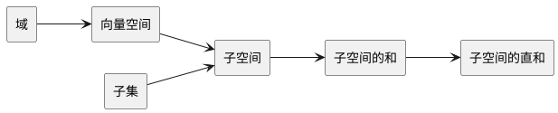

# 概念关系

# 向量空间
## 定义

给定集合 $V$ 和域 $\mathbf{F}$, 定义集合 $V$ 上的向量加法和标量乘法

$
\begin{aligned}
+&:&V \times V &\rightarrow V \\
\cdot &:&\mathbf{F} \times V &\rightarrow V \\
\end{aligned}
$

并满足如下八条公理:
1. 向量加法的结合律 &ensp;&ensp; $\left(\mathbf{u} + \mathbf{v}\right) + \mathbf{w} = \mathbf{u} + \left(\mathbf{v} + \mathbf{w}\right)$
2. 向量加法单位元的存在性 &ensp;&ensp; $\mathbf{u} + \mathbf{0} = \mathbf{u}$
3. 向量加法逆元的存在性 &ensp;&ensp; $\mathbf{u} + \left(-\mathbf{u}\right) = \mathbf{0}$
4. 向量加法的交换律 &ensp;&ensp; $\mathbf{u} + \mathbf{v} = \mathbf{v} + \mathbf{u}$
5. 标量乘法与 $\mathbf{F}$ 上乘法结合律的兼容性 &ensp;&ensp; $\alpha\left(\beta \mathbf{u}\right) = \left(\alpha\beta\right) \mathbf{u}$
6. 标量乘法单位元与 $\mathbf{F}$ 上乘法单位元的同一性 &ensp;&ensp; $1 \mathbf{u} = \mathbf{u}$
7. 标量乘法与 $V$ 上加法的分配律 &ensp;&ensp; $\alpha\left(\mathbf{u} + \mathbf{v}\right) = \alpha \mathbf{u} + \alpha \mathbf{v}$
8. 标量乘法与 $\mathbf{F}$ 上加法的分配率 &ensp;&ensp; $\left(\alpha + \beta\right)\mathbf{u} = \alpha\mathbf{u} + \beta\mathbf{u}$

那么称 $V$ 是 $\mathbf{F}$ 上的向量空间

* 若 $\mathbf{F} = \mathbb{R}$, 则 $V$ 为实数向量空间
* 若 $\mathbf{F} = \mathbb{C}$, 则 $V$ 为复数向量空间
* 若 $\mathbf{F}$ 为有限域 , 则 $V$ 为有限域向量空间

 

## 例子

### $\textbf{F}^{n}$

$\mathbf{F}^n = \left\{\left(x_1, \dots, x_n\right)\enspace\vert\enspace x_1, \dots, x_n \in \mathbf{F} \right\} $

$
\begin{aligned}
    +&:& \left(x_1, \dots, x_n\right) + \left(y_1, \dots, y_n\right) &= \left(x_1 + y_1, \dots, x_n + y_n\right) \\
\cdot&:& \lambda \left(x_1, \dots, x_n\right)                        &= \left(\lambda x_1, \dots, \lambda x_n\right) \\
\end{aligned}
$å

 

### $\textbf{F}^{\infty}$

$\mathbf{F}^{\infty} = \left\{\left(x_1, x_2, \dots\right)\enspace\vert\enspace x_1, x_2, \dots \in F\right\} $

$
\begin{aligned}
    +&:& \left(x_1, x_2, \dots\right) + \left(y_1, y_2, \dots\right) &= \left(x_1 + y_1, x_2 + y_2, \dots\right) \\
\cdot&:& \lambda \left(x_1, x_2, \dots\right)                        &= \left(\lambda x_1, \lambda x_2, \dots\right) \\
\end{aligned}
$

 

### $\textbf{F}^{S}$

$\mathbf{F}^S = \left\{f\enspace\vert\enspace f:S \rightarrow \mathbf{F}\right\} $

$
\begin{aligned}
    +&:& \left(f + g\right)\left(x\right)     &= f\left(x\right) + g\left(x\right) &\forall x \in S \\
\cdot&:& \left(\lambda f\right)\left(x\right)          &= \lambda f\left(x\right)           &\forall x \in S \\
\end{aligned}
$

 

$\mathbf{F}^{\infty}$ 和 $\mathbf{F}^n$ 可以被看成是 $\mathbf{F}^S$ 的特例

$
\begin{aligned}
\mathbf{F}^{\infty} &= \mathbf{F}^{\left\{1, 2, \dots\right\}} \\
\mathbf{F}^n        &= \mathbf{F}^{\left\{1, \dots, n\right\}} \\
\end{aligned}
$

 

# 子空间
## 定义

给定向量空间 $V$ 及其子集 $U$，保持向量加法和标量乘法定义不变，若 $U$ 也是向量空间， 那么称 $U$ 是 $V$ 的子空间

 

## 判定条件

1. $U$ 存在向量加法单位元 &ensp;&ensp; $\mathbf{0} \in U$ &ensp;&ensp;&ensp; ($\mathbf{0}$ 为 $V$ 的向量加法单位元)
2. $U$ 对向量加法满足封闭性 &ensp;&ensp; $u, v \in U \Rightarrow u + v \in U$
3. $U$ 对标量乘法满足封闭性 &ensp;&ensp; $\lambda \in \mathbf{F} \land u \in U \Rightarrow \lambda u \in U$

 

## 例子

1. 对任意向量空间 $V$， $\left\{ \mathbf{0} \right\}$ 是 $V$ 的子空间 &ensp;&ensp; ($\mathbf{0}$ 为 $V$ 的向量加法单位元)
 

2. $\left\{\left(x, y, 0\right) \enspace\vert\enspace x, y \in \mathbb{R} \right\}$ 是 $\mathbb{R}^3$ 的子空间
 

3. $\left\{\left(x, 2x \right) \enspace\vert\enspace x, y \in \mathbb{R} \right\}$ 是 $\mathbb{R}^2$ 的子空间
 

4. $\left\{f \enspace\vert\enspace f: [0, 1] \rightarrow \mathbb{R} \land \int_{0}^{1}f\left(x\right) \,\mathsf{d}x = 0 \right\}$ 是 $\mathbb{R}^{[0, 1]}$ 的子空间
 

5. $\left\{f \enspace\vert\enspace f: [0, 1] \rightarrow \mathbb{R} \land f^\prime\left(x\right) = 0 \right\}$ 是 $\mathbb{R}^{[0, 1]}$ 的子空间

 

## 子空间的和

### 定义

给定向量空间 $V$ 的子空间 $U_1$，$U_2$， 定义子空间的加法

$+: \enspace U_1 + U_2 = \left\{u_1 + u_2\enspace\vert\enspace u_1 \in U_1, u_2 \in U_2 \right\}$

同时称 $U_1 + U_2$ 为子空间 $U_1$ 与 $U_2$ 的和

 

### 性质

#### 子空间加法的结合律
$U_1 + \left(U_2 + U_3 \right) = \left(U_1 + U_2\right) + U_3$

 

#### 子空间加法的交换律
$U_1 + U_2 = U_2 + U_1$

 

#### 子空间加法单位元的存在性
$\left\{\mathbf{0}\right\} + U = U$ &ensp;&ensp; $\mathbf{0}$ 为 $V$ 的向量加法单位元

 

#### 最小子空间

$U_1 + U_2$ 是包含 $U_1, U_2$ 的最小子空间

1. $U_1 + U_2$ 是 $V$ 的子空间
2. $U_1, U_2 \sub U_1 + U_2$
3. 对 $V$ 的任意子空间 $W$，$U_1, U_2 \sub W \Rightarrow U_1 + U_2 \sub W$

 

## 子空间的直和

### 定义

给定向量空间 $V$ 的子空间 $U_1$，$U_2$，当且仅当 对 $U_1 +U_2$ 中任意元素 $w$，存在唯一的 $u_1 \in U_1$, $u_2 \in U_2$, 使得 $w = u_1 + u_2$

即

$\forall w \in U_1 +U_2 \enspace \exist u_1, u_1^{\prime} \in U_1 \enspace \exist u_2, u_2^{\prime} \in U_2, \enspace w = u_1 + u_2 = u_1^{\prime} + u_2^{\prime} \Rightarrow \left( u_1 = u_1^{\prime} \land u_2 = u_2^{\prime} \right)$ 

成立

则 $U_1 +U_2$ 为直接和，记为 $U_1 \oplus U_2$

考虑 $U_1 + U_2$ 的定义，上述命题可以简化为

$\forall u_1, u_1^{\prime} \in U_1 \enspace \forall u_2, u_2^{\prime} \in U_2, \enspace u_1 + u_2 = u_1^{\prime} + u_2^{\prime} \Rightarrow \left( u_1 = u_1^{\prime} \land u_2 = u_2^{\prime} \right)$

  

### 判定条件

#### 判定条件 1

当且仅当 存在唯一的 $u_1 \in U_1$, $u_2 \in U_2$, 使得 $\mathbf{0} = u_1 + u_2$ 且 $u_1 = u_2 = \mathbf{0}$

即

$\forall u_1 \in U_1 \enspace \forall u_2 \in U_2, \enspace u_1 + u_2 = \mathbf{0} \Rightarrow \left( u_1 = u_2 = \mathbf{0} \right)$

成立

则 $U_1 +U_2$ 为直接和

该判定条件可推广到任意多个子空间的和

 

#### 判定条件 2

当且仅当 $U_1 \cap U_2 = \left\{\mathbf{0}\right\}$, 则 $U_1 + U_2$ 为直接和

该判定条件可推广到任意多个子空间的和

