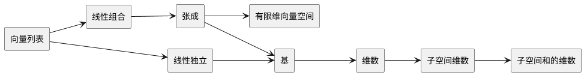

# 概念关系

# 张成
## 定义

给定 $\mathbf{F}$ 上向量空间 $V$，及向量列表 $\mathit{v}_1,\dots,\mathit{v}_m \in V$，其张成为
$
\begin{aligned}
\mathrm{span}\left(\mathit{v}_1,\dots,\mathit{v}_m\right) = \left\{\sum_{i = 1}^m a_i \mathit{v}_i \enspace \Big\vert \enspace a_i \in \mathbf{F}\right\} \\
\end{aligned}
$

其中元素
$
\begin{aligned}
\sum_{i = 1}^m a_i \mathit{v}_i
\end{aligned}
$
称为向量列表 $\mathit{v}_1,\dots,\mathit{v}_m$ 的线性组合

给定 $\mathbf{F}$ 上向量空间 $W$，当且仅当 $W = \mathrm{span}\left(\mathit{v}_1,\dots,\mathit{v}_m\right)$，那么称
$\mathit{v}_1,\dots,\mathit{v}_m$ 张成 $W$，或 $\mathit{v}_1,\dots,\mathit{v}_m$ 是 $W$ 的张成列表

给定向量空间 $V$, 当且仅当存在向量列表 $\mathit{v}_1,\dots,\mathit{v}_m \in V$，使得 $V = \mathrm{span}\left(\mathit{v}_1,\dots,\mathit{v}_m\right)$，那么 $V$ 为有限维向量空间

$V$ 是无限维向量空间，当且仅当它不是有限维向量空间

 

## 例子

$
\begin{aligned}
\mathbb{R}^2 = \mathrm{span}\left(\left(1, 0\right),\enspace \left(0, 1\right)\right)
\end{aligned}
$

$
\begin{aligned}
\mathbb{R}^2 = \mathrm{span}\left(\left(1, 0\right),\enspace \left(0, 1\right),\enspace \left(1, 1\right)\right)
\end{aligned}
$

$
\begin{aligned}
\mathcal{P}_m\left(\mathbf{F}\right) = \mathrm{span}\left(1, z,\dots, z^m\right)
\end{aligned}
$

$\mathcal{P}\left(\mathbf{F}\right)$ 是无限维向量空间

## 性质
 
$\mathrm{span}\left(\mathit{v}_1,\dots,\mathit{v}_m\right)$ 是包含 $\mathit{v}_1,\dots,\mathit{v}_m$ 的最小子空间

* 张成是子空间，因此又可以叫张成空间
* 张成空间包含向量列表
* 对任意包含向量列表的子空间，张成空间是其子集

# 线性独立

## 定义
给定 $\mathbf{F}$ 上向量空间 $V$，及向量列表 $\mathit{v}_1,\dots,\mathit{v}_m \in V$

$\mathit{v}_1,\dots,\mathit{v}_m$ 是线性独立的，当且仅当

$\forall a_1, \dots, a_m \in \mathbf{F} \enspace a_1\mathit{v}_1 + \dots + a_m\mathit{v}_m \Rightarrow a_1 = \dots = a_m = 0$

为了不失一般性，定义空列表是线性独立的

$V$ 中的向量列表是线性相关的，当且仅当它们不是线性独立的

## 例子

$(1, 0, 0),(0, 1, 0),(0, 0, 1) \in \mathbb{R}^3$ 是线性独立的

$(0, 0) \in \mathbb{R}^2$ 不是线性独立的

$1, z, \dots, z^m \in \mathcal{P}(\mathbf{F})$ 是线性独立的

## 线性相关引理

给定 $\mathbf{F}$ 上向量空间 $V$，及向量列表 $\mathit{v}_1,\dots,\mathit{v}_m \in V$

若 $\mathit{v}_1,\dots,\mathit{v}_m$ 是线性相关的，则存在 $ j \in \left\{1, \dots, m\right\}$, 使得 

1. $v_j \in \mathrm{span}\left(v_1, \dots, v_{j-1}\right)$
2. $\mathrm{span}\left(v_1, \dots, v_{j-1}, v_{j + 1}, \dots,v_m\right) = \mathrm{span}\left(v_1, \dots, v_m\right)$

## 线性独立列表长度与张成列表长度

有限维向量空间中，任意线性独立的列表长度，总是小于或等于该向量空间的张成列表的长度

证明:

$u_1, \dots, u_m \in V$ 是线性独立列表，$w_1, \dots, w_n$ 张成 $V$

1. 初始: $u_1, w_1, \dots, w_n$ 是长度为 $n + 1$ 的线性相关列表, 且张成 $V$
2. 移除: 根据**线性相关引理**， 可以从上面列表中移除 $w_i \enspace i \in \{1, \dots, n\}$, 使剩下的列表继续张成 $V$
3. 添加: 将 $u_j$ 添加到列表中，并放置到 $u_{j-1}$ 右侧

重复 步骤2 和 步骤 3， 将 $u_i$依次添加到列表中，并移除某个 $w_j$

在每一次移除和添加后，向量列表始终是长度为 $n + 1$ 的线性独立的列表，且张成 V.

若 $m > n$，那么在 $n$ 次添加和移除后，$w_j$完全被移除，最终会出现长度为 $n + 1$ 的向量列表 $u_1, \dots, u_{n+1}$。又 $u_1, \dots, u_{n+1}$ 是线性独立的，所以存在矛盾。
因此 $m \leq n$

## 有限维向量空间的子空间

有限维向量空间的子空间也是有限维的

# 基

## 定义

向量空间 $V$ 的基，是一个**线性独立**的**张成**列表

## 例子

$(1,0,\dots, 0), (0,1,\dots,0), \dots, (0, 0, \dots, 1)$ 是 $\mathbf{F}^n$ 的基，又被称为 $\mathbf{F}^n$ 的标准基

$1, z, \dots, z^m$ 是 $\mathcal{P}_m(\mathbf{F})$ 的基

## 性质

$V$ 中的任意向量，可以表示为基的**唯一**的线性组合

$V$ 的任意张成列表，可以通过移除其中的部分向量，变为 $V$ 的基

任意有限维向量空间都存在一组基

有限维向量空间中的任意线性独立列表，可以通过添加其他向量，变为 $V$ 的基

# 维数

## 定义

有限维向量空间 $V$ 中的任意基均有相同的长度，定义该长度为 $V$ 的维数，表示为 $\mathrm{dim}\,V$

## 例子

$\mathrm{dim}\,\mathbf{F}^n = n$

$\mathrm{dim}\,\mathcal{P}_m(\mathbf{F}) = m + 1$

## 性质

给定有限维向量空间 $V$, 若 $U$ 是 $V$ 的子空间，则 $\mathrm{dim}\, U \leq \mathrm{dim}\, V$

$V$ 中，长度为 $\mathrm{dim}\, V$ 的线性独立列表是 $V$ 的基

$V$ 中，长度为 $\mathrm{dim}\, V$ 的张成列表是 $V$ 的基

## 子空间和的维数

给定有限维向量空间 $V$，若 $U_1$ 和 $U_2$ 是 $V$ 的子空间，则
$\mathrm{dim}(U_1 + U_2) = \mathrm{dim}\, U_1 +  \mathrm{dim}\, U_2 -  \mathrm{dim}(U_1 \cap U_2)$
